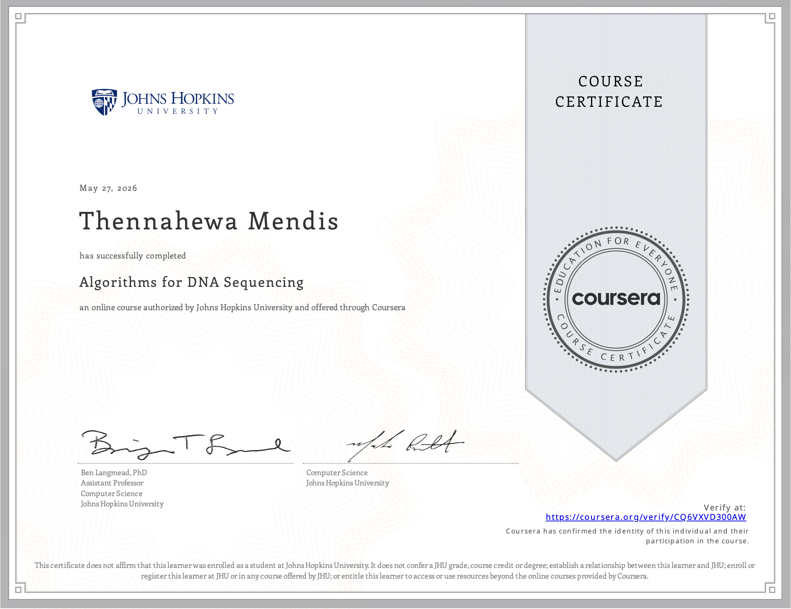

# Bioinformatics

A self-study portfolio of my journey into computational genomics and bioinformatics.

## About me

I'm TJ Mendis, a self-learner with a background in pure mathematics, computer science, and statistics, currently transitioning into computational biology with the long-term goal of pursuing a master's degree in the field. This repository documents the courses I work through, the side projects I build, and the books I read along the way.

## What's in this repo

The repository is organized so each learning resource gets its own folder. The naming convention encodes the source — for example, `algorithms-for-dna-sequencing-jhu/` for the JHU course, and any future folder for the same topic from a different source would sit beside it (e.g., `algorithms-for-dna-sequencing-ucsd/`).

Personal projects — research paper reproductions, original tools, side experiments — sit at the top level alongside the course folders, each in its own directory.

### Current contents

- **`algorithms-for-dna-sequencing-jhu/`** — Course 3 of Ben Langmead's *Genomic Data Science* specialization on Coursera (Johns Hopkins University). Lecture-following implementations of exact and approximate string matching algorithms applied to DNA sequencing.

More folders will be added as I work through additional material — the JHU Bioconductor course, MOOCs from other universities, textbooks like *Bioinformatics Algorithms* (Compeau & Pevzner), and original projects.

## Certificates

- **Algorithms for DNA Sequencing** — Johns Hopkins University via Coursera, May 2026. [Verify](https://coursera.org/verify/CQ6VXVD300AW).



## Attribution and academic integrity

The course material I work from is openly available pedagogical content authored by the respective instructors, and all course-derived work in this repository is properly attributed to the source. In particular:

- **Algorithms for DNA Sequencing (JHU)** is taught by Dr. Ben Langmead. His teaching materials, including lecture code and slides, are publicly available at [his teaching site](https://www.langmead-lab.org/teaching.html) and on his [GitHub](https://github.com/BenLangmead/ads1-notebooks). My notebooks in `algorithms-for-dna-sequencing-jhu/` are my own implementations following his lectures, with clear attribution where I reference his code or examples.

**On the Coursera honor code:** I am currently enrolled in this Coursera specialization. This repository contains only material from lecture videos and publicly available course content. **Graded programming assignments and quiz answers are not committed to this repository while I am enrolled.** This is a deliberate line: lecture-following code is openly shared by Dr. Langmead and reproducing it (with attribution) is appropriate; graded assessment work is not.

## Setup

To run the notebooks in this repository:

```bash
# Clone the repo
git clone git@github.com:TJMendis/bioinformatics.git
cd bioinformatics

# Create a virtual environment with Python 3.14 (or compatible)
python3 -m venv venv
source venv/bin/activate  # on Mac/Linux

# Install dependencies
pip install -r requirements.txt

# Launch Jupyter Lab
jupyter lab
```

Then navigate to the folder of interest and open the notebooks.

## Contact

GitHub: [@TJMendis](https://github.com/TJMendis)
